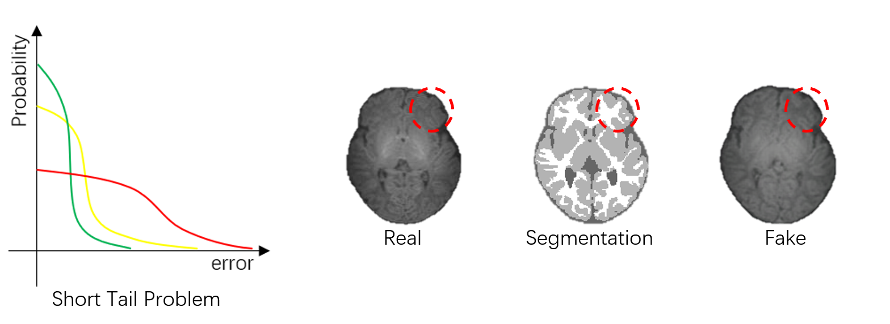
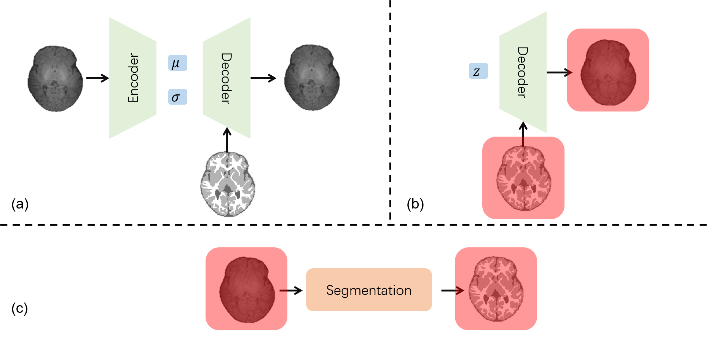
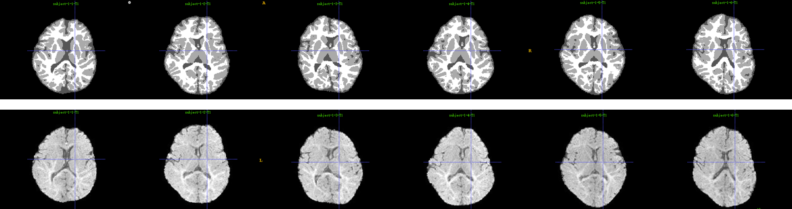

# Synthesis_based_Segmentation
The uncertainty in annotation may reduce the segmentation performance of the trained networks. For tackling the above issue, we propopose to use synthesis to help generate short tailed dataset, where the segmentation is accurately corresponding with the intensity image. As shown in the following figure, our aim is to reduce the error in the dataset to have a short tail distribution. On the right side of the figure, it can be seen that the fake image is more morphologically corresponding to the segmentation image than the real image. Note the fake image is synthesized based on the segmentation.

## Method
For obtaining more morphologically corresponding dataset, we firstly train a synthesis network. Then, the generated intensity image and the segmentation will be used to the segmentation network, as shown in the following figure. 

## Results
Here, we firstly show the synthesis result in the following figure.

Secondly, we show the segmentation result in the following figure. Note, we use the public dataset in iSeg2019 challenge.

## Acknowledgement
We would like to thank the code of [nnUNet](https://github.com/MIC-DKFZ/nnUNet) and [SPADE](https://github.com/NVlabs/SPADE). 

## Contact
For any problems, please open an [issue](https://github.com/Barnonewdm/Synthesis_based_Segmentation/issues/new).
